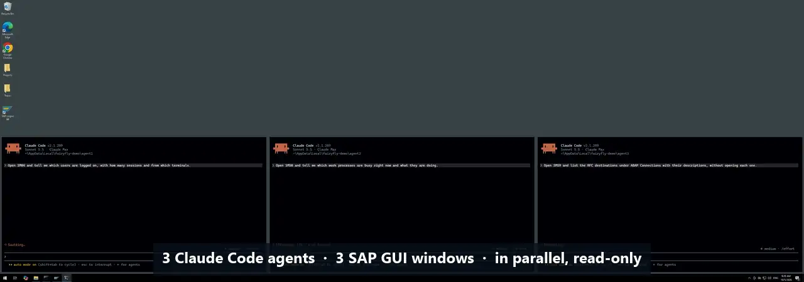

  <picture>
    <source media="(prefers-color-scheme: dark)" srcset="assets/logo/fairyfly_logo_dark.svg">
    
  </picture>

# fairyfly

**Let AI agents work in SAP through the SAP GUI your people already use.**

fairyfly lets AI agents such as Claude, and your own scripts, read and operate SAP GUI for Windows screens. It runs
on a Windows machine next to SAP GUI. It can open a transaction, read the screen as structured data, fill in a
selection, click a button and report back. The agent works as the logged-on SAP user with that user's own
authorizations, so no new services or interfaces have to be built in SAP.

  
   
  Three Claude Code agents, three SAP GUI windows, in parallel and read-only: each agent opens and logs on to its
  own window, runs a Basis transaction (SM04, SM50, SM59) and answers in plain language. Real recording, sped up 2.5x.
  <b>Click for the full-size version.</b>

## Why fairyfly

When a suitable, approved API exists, use it. Often it does not: building a "proper" SAP integration for an AI agent
then means OData services, RFC users, BAPIs or an SAP BTP project, with design, development, transports, security
review and budget. Teams that want to try an agent this week, or that cannot get an API approved, are stuck.

fairyfly takes the other route. It uses **SAP GUI Scripting**, the automation interface built into SAP GUI for
Windows, so the agent sees what a user sees:

- **No backend development.** Nothing is installed or developed in the SAP system. Transactions the user can open,
  including custom Z-transactions and classic reports, can be automated right away. As with any automation, validate
  each workflow before relying on it; fairyfly works on SAP GUI for Windows screens, not on Fiori or browser apps.
- **Works within existing permissions.** The agent acts as the logged-on SAP user, and SAP's own authorization checks
  apply to every step. Rights are granted and withdrawn with standard SAP user administration.
- **Safe by default for agents.** The MCP server for agents starts in read-only guard mode: it refuses Save, Delete,
  Post, Release and similar actions and does not type into fields until you explicitly allow write mode. Commands
  and tool calls are recorded in a local audit trail (on by default).
- **Agent-ready.** fairyfly includes an [MCP](https://modelcontextprotocol.io) server, so Claude Code, Claude Desktop
  and other MCP clients can use it right away, on the same machine or securely over the network.

One SAP setting is required: an SAP administrator has to allow SAP GUI Scripting on the system (profile parameter
`sapgui/user_scripting`). [docs/SETUP.md](docs/SETUP.md) explains this step and how to limit scripting to selected
users.

## How it works

~~~text
  AI agent (Claude Code, Claude Desktop,    your scripts and
  any MCP client)                           automation jobs
          |  MCP (local, or HTTPS + token)        |  command line, JSON output
          v                                       v
  +------------------------------------------------------------+
  |  fairyfly.exe  (Windows, in the user's desktop session)    |
  |  read-only guard - redaction - audit trail - access tokens |
  +------------------------------------------------------------+
          |  SAP GUI Scripting (COM)
          v
  SAP GUI for Windows  --->  your SAP system (ECC, S/4HANA, BW, ...)
~~~

fairyfly reads each screen into structured data (fields, buttons, tables, grids, tabs and status messages) that an
agent can reason about, and turns the agent's decisions into ordinary SAP GUI actions. Details are in
[docs/ARCHITECTURE.md](docs/ARCHITECTURE.md).

## What you can do with it

Ask the agent in plain language. In read-only guard mode, the agent can navigate, read and click through screens:

- "Open ST22 and tell me which short dumps occurred today and in which programs."
- "Which RFC destinations in SM59 point to the production system?"
- "Show me the work processes in SM50 and tell me which ones are busy."

Tasks that type into a selection screen need write mode, or a remote access token that allows selection input
([MCP.md](docs/MCP.md#tokens-and-scopes)):

- "Check SM37 for jobs that failed since yesterday and summarize why."
- "Show me the logon data and roles of user JDOE in SU01."
- "Fill in the selection screen of report ZSALES for company code 1000 and give me the totals."

The same operations are available as commands for scripts and scheduled jobs.

## Quick start

**You need:** Windows 10/11 or Windows Server, SAP GUI for Windows with scripting enabled, and an SAP user that can
log on. [docs/SETUP.md](docs/SETUP.md) has the full checklist.

**1. Get fairyfly.** Download `fairyfly.exe` from the
[GitHub releases page](https://github.com/DataZooDE/fairyfly/releases) once a release is published (a single file,
no installer), or [build it from source](docs/BUILDING.md). Put it in a folder of your choice, for example
`C:\Tools\fairyfly\`, and add that folder to your `PATH` (the examples below assume `fairyfly` is found; otherwise
use the full path `C:\Tools\fairyfly\fairyfly.exe`).

**2. Check the machine.** Start SAP GUI, log on to your system, then run:

~~~powershell
fairyfly doctor
~~~

`doctor` checks that SAP GUI is running, that scripting is enabled and that an SAP session is open, and suggests a
fix for every problem it finds.

**3. Connect your AI agent.** For Claude Code on the same machine:

~~~powershell
claude mcp add fairyfly -- C:\Tools\fairyfly\fairyfly.exe mcp
~~~

Then ask Claude something like *"Use fairyfly to read the current SAP screen and tell me what you see,"* or
*"Open ST22 and summarize today's short dumps."* For Claude Desktop, other MCP clients and write mode, see
[docs/MCP.md](docs/MCP.md).

**Prefer the command line?** The same steps as commands:

~~~powershell
fairyfly session list                                     # open SAP GUI sessions and their ids
fairyfly session attach --session-id "/app/con[0]/ses[0]" # save one; the result has its connection_id
fairyfly transaction start SM37 --connection 0            # open a transaction
fairyfly screen read --connection 0 --output markdown     # read the screen (JSON is the default)
~~~

The [CLI guide](docs/CLI.md) covers every command, `batch` mode for many steps in one process, and the output
formats (JSON, Markdown, TOON).

## Safety and control

fairyfly operates a real SAP system, so control is built in at every level:

| Control | What it means |
|---|---|
| **SAP authorizations** | The agent can never do more than the logged-on SAP user is allowed to do. |
| **Read-only guard** | The MCP server starts in read-only guard mode (the CLI with `--read-only`): navigation and reading work; buttons, menus and keys for saving, deleting, posting and similar actions are refused, and typing is off. The guard recognises actions by ids and (English) texts, so it is a strong guard rail, not a guarantee. Write mode is switched on explicitly (`mcp --allow-write`); `FAIRYFLY_READ_ONLY=1` prevents enabling it. |
| **No passwords through the agent** | SAP logon uses credentials stored in the Windows Credential Manager. The logon tools take a credential name, never a password, and passwords never appear in results, logs or the audit trail. |
| **Audit trail** | On by default: every command and tool call is recorded locally (which tool, SAP system, user, transaction, result). Screen contents and entered values are never recorded. |
| **Sensitive values redacted** | Passwords, password hashes and similar fields are masked in the structured screen data fairyfly returns. Screenshots are images and are not redacted. |
| **Remote access only with tokens** | Network access uses HTTPS and named access tokens. Each token can be limited to specific tools, SAP systems, transactions, client addresses and an expiry date. |
| **No telemetry** | fairyfly only talks to SAP GUI on the same machine and to the MCP clients you connect. |

Text read from SAP screens is passed to the agent as untrusted data, to reduce prompt-injection risk. Read
[docs/SECURITY.md](docs/SECURITY.md) before using fairyfly on a production system.

## Agents on another machine

Is your agent running on Linux, macOS or in a container? `fairyfly mcp --http` turns the Windows machine into a
secure MCP endpoint. One setup command creates the certificate and network configuration, and a tray icon keeps the
server running in the background. See [docs/MCP_REMOTE.md](docs/MCP_REMOTE.md).

## Documentation

| Guide | What it covers |
|---|---|
| [Setup](docs/SETUP.md) | Requirements, enabling SAP GUI Scripting, first connection, credentials, troubleshooting |
| [AI agents (MCP)](docs/MCP.md) | Connecting Claude Code, Claude Desktop and other MCP clients; tools; read-only and write mode |
| [Remote access](docs/MCP_REMOTE.md) | HTTPS endpoint, access tokens, client configuration, operations |
| [Command line](docs/CLI.md) | All commands, output formats, batch mode, audit trail |
| [Security](docs/SECURITY.md) | Security model, threat model, data handling, release integrity |
| [Architecture](docs/ARCHITECTURE.md) | How fairyfly is built and where it stores what |
| [Building from source](docs/BUILDING.md) | Toolchain, build, tests, releases |

The full index is in [docs/README.md](docs/README.md). `fairyfly --help` always shows the commands of the version
you have.

## Status and limits

- Windows only. SAP GUI Scripting needs the interactive desktop of a logged-on Windows user, so fairyfly runs as a
  normal program or tray app, not as a Windows service.
- The current version is `2026.09.30` (calendar versioning). fairyfly is under active development; changes are
  listed in the [changelog](CHANGELOG.md).
- fairyfly drives the screen like a person does: an action on one SAP window happens one step at a time, and large
  screens take a few seconds to read.

## License

fairyfly is licensed under the [Business Source License 1.1](LICENSE) (licensor: DataZoo GmbH), the same terms as
[DataZooDE/erpl](https://github.com/DataZooDE/erpl). You may copy, modify, redistribute and use it in production. You
may not offer it to third parties as a hosted or embedded service. On the Change Date defined in the license, the
code changes to the MPL 2.0. Third-party libraries and their licenses are listed in
[THIRD_PARTY_NOTICES.md](THIRD_PARTY_NOTICES.md).
